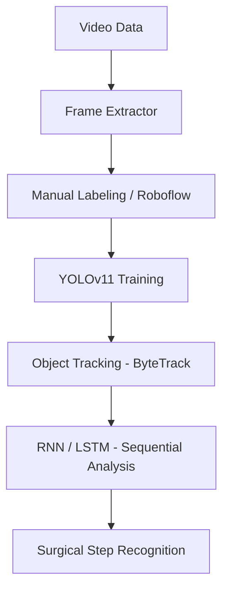

# 🎬 Surgical Frame Extractor + Similarity Filter (Updated)

เครื่องมือสำหรับสกัดภาพนิ่งจากวิดีโอการผ่าตัด/เย็บแผล เพื่อใช้ในการเตรียมชุดข้อมูล (Dataset) สำหรับ Training AI เช่น YOLOv11 โดยเน้นการลดภาพซ้ำและภาพเบลอโดยอัตนัติ

---

## 🛠 ความสามารถหลัก (Key Features)

### 1. ระบบสกัดภาพอัจฉริยะ (Smart Extraction)
- **Fixed Interval:** ตัดภาพตามคาบเวลาที่กำหนด (เช่น ทุกๆ 2 วินาที)
- **Adaptive Target:** คำนวณเวลาตัดภาพให้อัตโนมัติเพื่อให้ได้จำนวนภาพที่ต้องการ (เช่น อยากได้ 30 ภาพต่อ 1 วิดีโอ ไม่ว่าวิดีโอจะสั้นหรือยาว)

### 2. การกรองภาพซ้ำ (Similarity Filtering)
มี 4 โหมดให้เลือกตามความเหมาะสม:
- **None:** ไม่กรองเลย (เหมาะสำหรับนำไปคัดเลือกด้วยตาเอง)
- **Motion IoU (แนะนำสำหรับผ่าตัด):** วิเคราะห์เฉพาะการเคลื่อนไหวของมือและเครื่องมือผ่าตัด โดยไม่สนใจพื้นหลังที่นิ่ง
- **Frame Diff:** เปรียบเทียบความต่างของพิกเซลโดยตรง
- **pHash:** เปรียบเทียบโครงสร้างทางสถิติของภาพ

### 3. ระบบ Slot-based Fallback (ใหม่!)
แก้ปัญหาภาพขาดเมื่อเจอภาพเสีย:
- หากเฟรมที่เลือกเกิด **เบลอ** หรือ **ซ้ำกับภาพก่อนหน้า** โปรแกรมจะค้นหาเฟรมถัดไปในวินาทีเดียวกันทันที
- **Max Attempts:** สามารถจำกัดจำนวนครั้งในการค้นหาต่อ 1 ช่วงเวลาได้ เพื่อป้องกันการประมวลผลที่นานเกินไป

### 4. ระบบกรองภาพเบลอ (Blur Detection)
- ใช้ **Laplacian Variance** ในการคำนวณค่าความคมชัด
- หากค่าต่ำกว่าที่ตั้งไว้ โปรแกรมจะข้ามเฟรมนั้นและหาเฟรมใหม่ที่คมชัดกว่าให้

---

## ⚙️ คำอธิบายพารามิเตอร์

| พารามิเตอร์ | คำอธิบาย |
| :--- | :--- |
| **Min Diff (Threshold)** | ค่าความต่างขั้นต่ำ (ยิ่งสูง = ยิ่งเข้มงวด ภาพต้องต่างกันมากถึงจะยอมบันทึก) |
| **Blur Threshold** | ค่าความคมชัด (ยิ่งสูง = ยิ่งต้องการภาพที่ชัดมาก) |
| **Max Attempts/Slot** | จำนวนครั้งที่จะพยายามหาเฟรมใหม่แทนเฟรมที่เสียใน 1 ช่วงเวลา |
| **Slot Fallback** | เปิด/ปิด ระบบค้นหาเฟรมทดแทนอัตโนมัติ |

---

## 📂 โครงสร้าง Output

โปรแกรมจะสร้างโฟลเดอร์ผลลัพธ์แยกตามชื่อวิดีโอ (หากเลือก) และแนบไฟล์ Log มาให้ด้วย:
```text
output/
├── video_01/
│   ├── frame_00001.jpg
│   ├── frame_00002.jpg
│   └── extraction_log.json  <- บันทึกค่า Similarity และสถิติการข้ามภาพ
```

---

## 🚀 แผนการพัฒนาในเฟสถัดไป (Future Pipeline)



1. **Phase 1 (Current):** สกัดภาพและกรองความคล้ายคลึง
2. **Phase 2:** นำภาพไปเทรน YOLOv11 เพื่อตรวจจับเครื่องมือและมือ
3. **Phase 3:** ใช้ข้อมูลตำแหน่ง (Coordinates) มาวิเคราะห์ลำดับขั้นตอน (จับเข็ม -> แทง -> ดึงด้าย)

---

## การติดตั้งและใช้งาน

```bash
# ติดตั้ง Library ที่จำเป็น
pip install opencv-python imagehash Pillow numpy tqdm

# รันโปรแกรม
python frame_extractor.py
```

> **หมายเหตุ:** โปรแกรมจะเปิดขึ้นมาในโหมดขยายเต็มจอ (Maximized) เพื่อให้เห็นปุ่ม Start/Stop ชัดเจน และมีระบบ Scrollbar หากหน้าจอมีขนาดเล็ก
