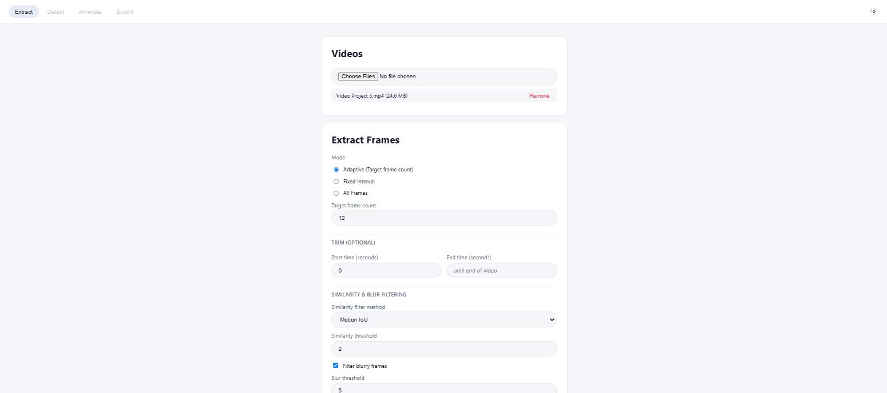
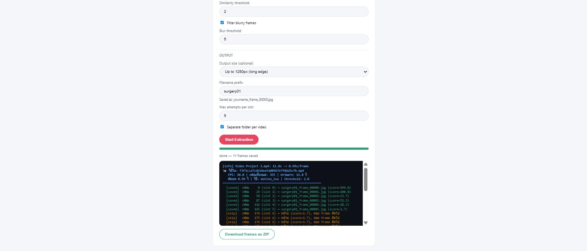

# รายงานเว็บแอป VideoFrameExtractor: สถานะปัจจุบัน (Extract Pipeline)

**วันที่จัดทำ**: 30 กรกฎาคม 2026
**ขอบเขต**: `01_frame-extractor-tool/webapp/` (เว็บเวอร์ชันของ `app.py` เดิม)

---

## 1. บทนำ / ภาพรวมเอกสาร

เอกสารนี้สรุปว่า **เว็บแอปตอนนี้เป็นอะไร ทำอะไรได้แล้วบ้าง** — เฉพาะส่วนที่สร้างเสร็จและใช้งานได้จริงในโค้ด
ปัจจุบันเท่านั้น ไม่รวมแผนอนาคต (แผนเชื่อมต่อกับโมเดล YOLO/Annotate/Export ยังอยู่ในเอกสารแยกต่างหาก
`_archive/WORK_PLAN.md` — จะสรุปเป็นรายงานเพิ่มเติมทีหลังเมื่อเริ่มลงมือสร้างส่วนนั้นจริง)

---

## 2. ตำแหน่งของเว็บแอปในภาพรวมโปรเจกต์

โปรเจกต์นี้คือระบบ AI ตรวจจับเครื่องมือผ่าตัด/บริเวณแผลจากวิดีโอผ่าตัด สำหรับบริบทสัตวแพทย์ โดยมีวัตถุที่
ต้องตรวจจับ 5 ประเภท: `needle`, `finger`, `needle_holder`, `wound`, `forcep`

เดิมทีทั้ง pipeline (สกัดเฟรม → ตรวจจับ → annotate → export dataset) รันผ่านแอป Tkinter บนเครื่อง (`app.py`)
เท่านั้น เว็บแอปมีเป้าหมายย้ายมาไว้บนเบราว์เซอร์ **ตอนนี้สร้างเสร็จแค่ขั้นตอนแรก (Extract Frames) เท่านั้น**
เนื้อหาที่เหลือของรายงานฉบับนี้คือรายละเอียดของขั้นตอนที่สร้างเสร็จแล้วนี้

---

## 3. สถานะปัจจุบัน: สิ่งที่สร้างเสร็จแล้ว

### 3a. สถาปัตยกรรม / แนวคิดการออกแบบ

เว็บแอปตั้งใจใช้เครื่องมือให้น้อยที่สุดเท่าที่จำเป็น (ตามหลักการที่ยึดมาตลอดทั้งโปรเจกต์) — ไม่ใช่ของที่ยัง
ทำไม่ครบ แต่เป็นทางเลือกออกแบบตั้งแต่ต้น:

| ด้าน | สิ่งที่ใช้จริง |
|---|---|
| Backend | Python + FastAPI + Uvicorn — **ไม่มี database/ORM** (`webapp/requirements.txt` มี 4 ตัว: `fastapi`, `uvicorn[standard]`, `python-multipart`, `python-dotenv`) |
| Dependency ที่สืบทอดมา | `server.py` `import cv2` และเรียก `frame_extractor.py` ของเครื่องมือเดิม → ต้องติดตั้ง `01_frame-extractor-tool/requirements.txt` (opencv-python, numpy, Pillow, imagehash ฯลฯ) ด้วย **ไม่งั้น server จะสตาร์ตไม่ขึ้น** |
| State | dict ในหน่วยความจำ + snapshot ลง `webapp/state.json` (เขียนแบบ atomic ผ่าน `.tmp` + `os.replace`) พร้อม rolling backup (`state.json.bak`) และ periodic snapshot ทุก ~15 นาทีใน `data/backups/` (เก็บย้อนหลังสูงสุด 10 ไฟล์) |
| งานหนัก (extract ฯลฯ) | `threading.Thread` ธรรมดา ไม่มี job queue framework |
| ความคืบหน้าระหว่างงาน | HTTP polling (`GET /api/extract/{job_id}` ทุก 1 วินาที) ไม่มี WebSocket |
| Frontend | ไฟล์เดียวต่ออย่าง: `static/index.html` + `style.css` + `app.js` ไม่มี framework/build step และไม่โหลด asset จากภายนอก |
| Auth | **ไม่มี** ในเวอร์ชันนี้ — ตัดออกทั้งหมดโดยตั้งใจ (ดูหมายเหตุด้านล่าง) |
| Security headers | middleware เล็กๆ ใส่ `X-Content-Type-Options: nosniff` และ `X-Frame-Options: DENY` ทุก response |
| ตั้งค่าผ่าน `.env` | `DATA_DIR` (ที่เก็บวิดีโอ/เฟรม) และ `MAX_UPLOAD_SIZE_MB` (ค่าเริ่มต้น 8192 = 8 GB, เกินแล้วตอบ HTTP 413) |

**หมายเหตุสำคัญเรื่อง auth**: `WORK_PLAN.md` เดิมออกแบบระบบ login/password ไว้ (S-1 — session token,
rate-limit ล็อกอินผิด) และเคย implement จริงแล้วครั้งหนึ่ง (commit `215075c`) แต่ผู้ใช้ตัดสินใจ **เอาออกทั้งหมด**
ในภายหลัง เพื่อให้เวอร์ชันแรกใช้งานได้ทันทีไม่มีด่านกั้น จะพิจารณาเพิ่มกลับทีหลังเมื่อมีฟีเจอร์มากขึ้น
โค้ด auth เดิมยังอยู่ใน git history ไม่ได้เก็บเป็น dead code ในไฟล์ปัจจุบัน — เป็นความตั้งใจต่างจากที่
`WORK_PLAN.md` เขียนไว้ (เอกสารนั้นยังไม่ได้อัปเดตตามการตัดสินใจนี้)

### 3b. ฟีเจอร์ที่ทำแล้ว (ขั้น Extract)

- อัปโหลด/ดู/ลบวิดีโอ (`.mp4 .avi .mov .mkv .wmv`)
- สกัดเฟรม 3 โหมด: Fixed Interval / Adaptive Target / All Frames
- กรองภาพซ้ำ (motion IoU / frame diff / pHash) และกรองภาพเบลอ (Laplacian variance) — ปิดการทำงานอัตโนมัติ
  เมื่อเลือกโหมด All Frames (ให้ตรงกับพฤติกรรมของ `app.py` เดิม)
- **Trim**: ตัดเฉพาะช่วงเวลา (`start_sec`/`end_sec`) ของวิดีโอก่อนสกัดเฟรม
- **Resize เอาต์พุต**: ย่อภาพที่บันทึกตามด้านยาวสุด (`resize_max_px`, ย่อได้ทางเดียว ไม่ขยาย)
- **ดาวน์โหลดเป็น ZIP**: รวมเฟรมทั้งหมดของงานเป็นไฟล์ zip เดียว (ใช้ `zipfile` จาก stdlib ล้วนๆ) — ปุ่มจะขึ้น
  เมื่องานจบแล้วและมีเฟรมที่บันทึกได้อย่างน้อย 1 ภาพ (ทั้งกรณีจบปกติและกรณีกดหยุดกลางคัน)
- ตั้งชื่อไฟล์อัตโนมัติ: ผู้ใช้พิมพ์แค่ label (เช่น `surgery01`) ระบบเติม `_frame_` + เลขลำดับ 5 หลักให้เอง
  โดย**เริ่มนับจาก `00000`** → ไฟล์แรกคือ `surgery01_frame_00000.jpg` (ถ้าเว้นว่างจะได้ `frame_00000.jpg`)
- ทุกครั้งที่สกัดเสร็จ ระบบจะเขียนไฟล์ **`extraction_log.json`** ไว้ในโฟลเดอร์ผลลัพธ์ด้วย — เก็บสถิติของงานนั้น
  และค่า similarity ของทุกเฟรมที่พิจารณา (ใช้ย้อนดูได้ว่าเฟรมไหนถูกข้ามเพราะอะไร)

หมายเหตุ: ฟีเจอร์ trim/resize/ZIP ทั้งสามอย่างนี้**ไม่มีอยู่ใน `WORK_PLAN.md`'s S-3 เดิม** — เป็นสิ่งที่เพิ่มเข้ามา
ทีหลังตามคำขอของผู้ใช้ (อ้างอิงจากฟีเจอร์ "video to JPG" ของ ezgif.com) ถือเป็นส่วนต่อขยายจากแผนเดิม ไม่ใช่
ความคลาดเคลื่อน

### 3c. หน้าตาเว็บ (ภาพจากระบบที่รันจริง)

เว็บเป็นหน้าเดียว (single page) **ไม่มีหน้า landing/แนะนำโครงการแยกต่างหาก** — เปิดเว็บมาจะเจอเครื่องมือ
Extract ทันที ด้านบนมีแถบแท็บ 4 ขั้นตอน (Extract / Detect / Annotate / Export) โดย **3 แท็บหลังยังเป็นปุ่มที่
ปิดใช้งานไว้ (`Coming soon`)** ตามสถานะที่ยังไม่ได้พัฒนา และมุมขวาบนมีปุ่มตั้งค่าธีม (Follow system / Dark /
Light) ที่จำค่าที่เลือกไว้ใน `localStorage`

ภาพที่ 1 — หน้าฟอร์ม Extract (รายการวิดีโอที่อัปโหลด + ตัวเลือกโหมด/trim/ตัวกรอง):

ภาพที่ 2 — ผลการรันจริง: สกัดได้ 11 ภาพจากเป้าหมาย 12 ภาพ พร้อม log ที่แสดงชื่อไฟล์ที่บันทึก ค่า similarity
ของแต่ละเฟรม เหตุผลที่บางเฟรมถูกข้าม และปุ่มดาวน์โหลด ZIP:

> ข้อมูลในภาพเป็นการทดสอบจริงกับวิดีโอสาธิตความยาว 11.8 วินาที (355 เฟรม, 30 FPS) โดยตั้งค่าย่อภาพเป็น
> 1280px ด้านยาว ผลลัพธ์ที่ได้คือไฟล์ `surgery01_frame_00000.jpg` … `surgery01_frame_00010.jpg` ขนาด
> 1280×720 พิกเซล

### 3d. API endpoint ปัจจุบัน (ตรวจสอบจาก `server.py` จริง)

| Method | Path | หน้าที่ |
|---|---|---|
| GET | `/api/health` | เช็คสถานะ server |
| POST | `/api/videos` | อัปโหลดวิดีโอ (multi-file) |
| GET | `/api/videos` | ดูรายการวิดีโอ |
| DELETE | `/api/videos/{video_id}` | ลบวิดีโอ |
| POST | `/api/extract` | เริ่มงานสกัดเฟรม (คืน `job_id`) |
| GET | `/api/extract/{job_id}` | ดูสถานะ/progress/log ของงาน (polling) |
| GET | `/api/extract/{job_id}/frames` | ดูรายการเฟรมที่สกัดได้จากงานนี้ |
| POST | `/api/extract/{job_id}/stop` | สั่งหยุดงานกลางคัน |
| GET | `/api/extract/{job_id}/zip` | ดาวน์โหลดเฟรมทั้งหมดของงานเป็น ZIP |

**ยังไม่มี endpoint ใดๆ เกี่ยวกับการตรวจจับโมเดล (detect/annotate/export/models) ในโค้ดปัจจุบันเลย**

---

## 4. ข้อจำกัดของเวอร์ชันปัจจุบัน

- **`state.json` ไม่มี DB/version history** — มี rolling backup (`.bak`) + periodic snapshot (ทุก 15 นาที
  เก็บย้อนหลัง 10 ไฟล์) เป็น safety net แต่ยังไม่มี UI สำหรับ restore (ต้องทำมือผ่านการ copy ไฟล์กลับ)
- **Auth ที่หายไป**: เว็บตอนนี้เปิดให้ใช้งานได้โดยไม่มีการยืนยันตัวตนเลย เหมาะกับการใช้งาน local/ทดสอบ แต่ถ้า
  จะ deploy ขึ้น cloud ให้คนอื่นเข้าถึงได้ ต้องพิจารณาเพิ่มระบบยืนยันตัวตนกลับมาก่อน
- **แท็บ Detect / Annotate / Export ยังเป็นปุ่มเปล่า** — แสดงในหน้าเว็บเพื่อบอกลำดับขั้นตอนของระบบ แต่ยัง
  กดใช้งานไม่ได้ (`disabled`) เพราะยังไม่ได้พัฒนาส่วนนั้น
- **ออกแบบมาสำหรับผู้ใช้ทีละคน** — สถานะงานเก็บในหน่วยความจำของ process เดียว ถ้า restart server ระหว่างที่
  งานกำลังรัน งานนั้นจะหายไป (เฟรมที่บันทึกลงดิสก์แล้วยังอยู่ครบ)
